# docker lab 2

---

## concepts

### cmd vs entrypoint

- `cmd` sets default arguments that can be overridden when running the container
- `entrypoint` sets the fixed executable that always runs, arguments are appended to it

### copy vs add

- `copy` just copies files from your machine into the image
- `add` does the same but also extracts archives and can download from urls
- use `copy` by default unless you need the extra features of `add`

---

## problem 1 — nginx with volume mount

create two named volumes, run nginx using them, edit the html, remove the container, then run two new containers using the same volumes to prove data persists.

```bash
docker volume create html-content
docker volume create nginx-config

docker run -d --name my-nginx -v html-content:/usr/share/nginx/html -v nginx-config:/etc/nginx nginx

docker exec -it my-nginx bash
echo '<h1>hello from volume</h1>' > /usr/share/nginx/html/index.html
exit

docker rm -f my-nginx

docker run -d --name nginx-1 -v html-content:/usr/share/nginx/html -v nginx-config:/etc/nginx -p 8080:80 nginx
docker run -d --name nginx-2 -v html-content:/usr/share/nginx/html -v nginx-config:/etc/nginx -p 8081:80 nginx
```

creating volumes and running container with both attached:

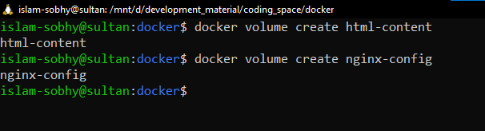
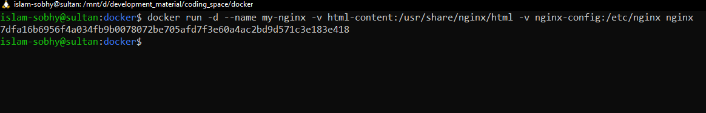

editing html content inside the container:

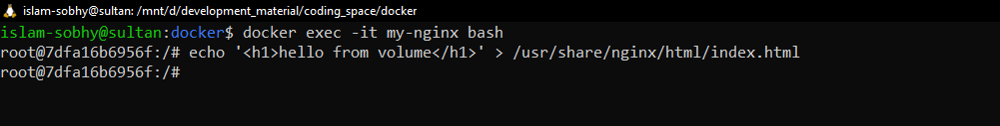

removing original container and running two new ones with the same volumes:

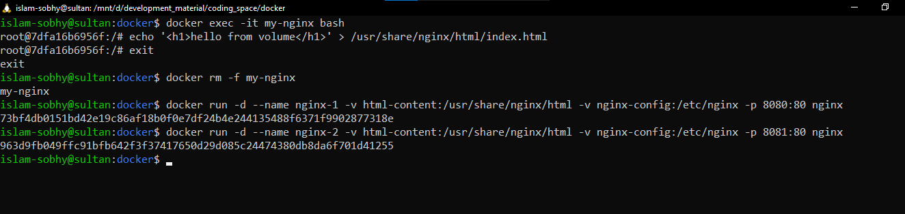

both new containers serve the same html — data survived the container removal:


---

## problem 2 — nginx with bind mount

run nginx using bind mount pointing to a folder on your machine, edit the html, remove the container, then run a new container with the same bind mount path to prove data persists.

```bash
docker run -d --name nginx-bind-mount -v ~/nginx-html:/usr/share/nginx/html nginx

docker exec -it nginx-bind-mount bash
echo '<h1>hello from bind mount</h1>' > /usr/share/nginx/html/index.html
exit

docker rm -f nginx-bind-mount

docker run -d --name nginx-bind-mount-new -v ~/nginx-html:/usr/share/nginx/html nginx

docker exec -it nginx-bind-mount-new bash
cat /usr/share/nginx/html/index.html
```

running container with bind mount:

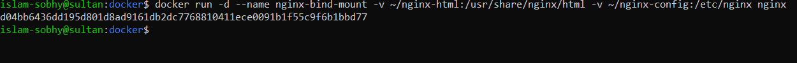

editing html inside the container:

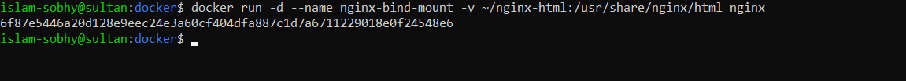

removing container:

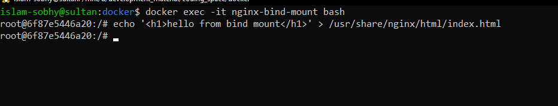

running new container with same bind mount path:

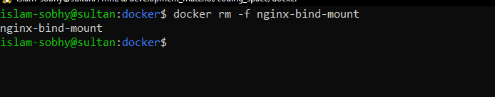

old html content is still there in the new container — because the file lives on the host machine, not inside the container:

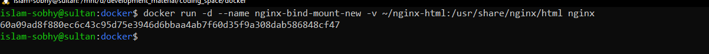

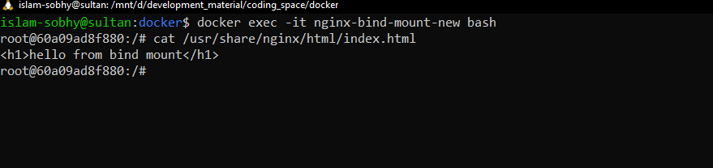

---

## problem 3 — container networking

create two nginx containers on two different networks, prove they can't reach each other, then connect them to the same network and prove they can.

```bash
docker network create network-1
docker network create network-2

docker run -d --name nginx-net1 --network network-1 nginx
docker run -d --name nginx-net2 --network network-2 nginx

# try to reach nginx-net2 from nginx-net1 — fails
docker exec -it nginx-net1 bash
curl http://nginx-net2
exit

# connect nginx-net1 to network-2
docker network connect network-2 nginx-net1

# try again — works now
docker exec -it nginx-net1 bash
curl http://nginx-net2
```

creating networks and running containers on separate networks:

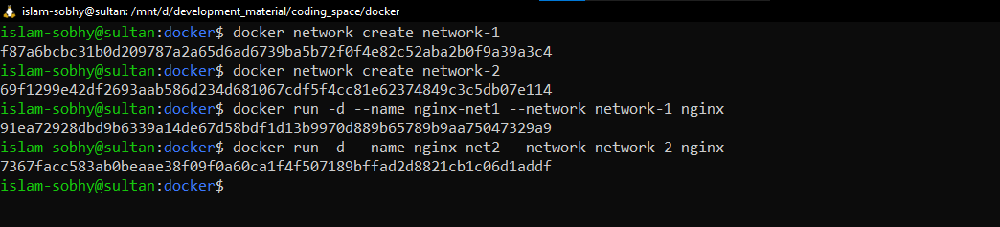

curl fails — containers are isolated on different networks:

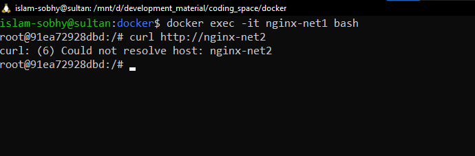

after connecting nginx-net1 to network-2, curl succeeds and returns the nginx html:

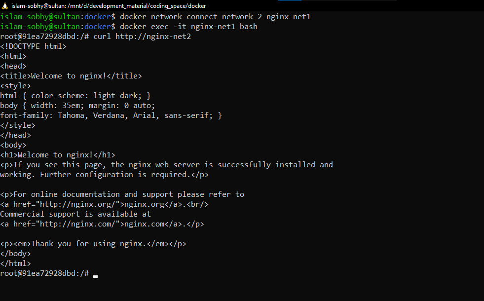

---

## problem 4 — docker compose with nginx and mysql

```yaml
services:
  mysql:
    image: mysql
    environment:
      MYSQL_ROOT_PASSWORD: secret
    ports:
      - "3306:3306"

  nginx:
    image: nginx
    ports:
      - "8080:80"
    depends_on:
      - mysql
```

```bash
docker compose up -d
```

mysql starts first because of `depends_on`, then nginx starts after it. both containers are on the same default network docker compose creates automatically.

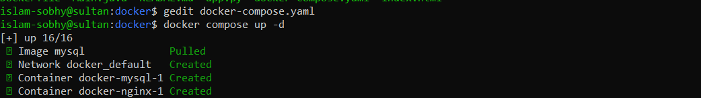
